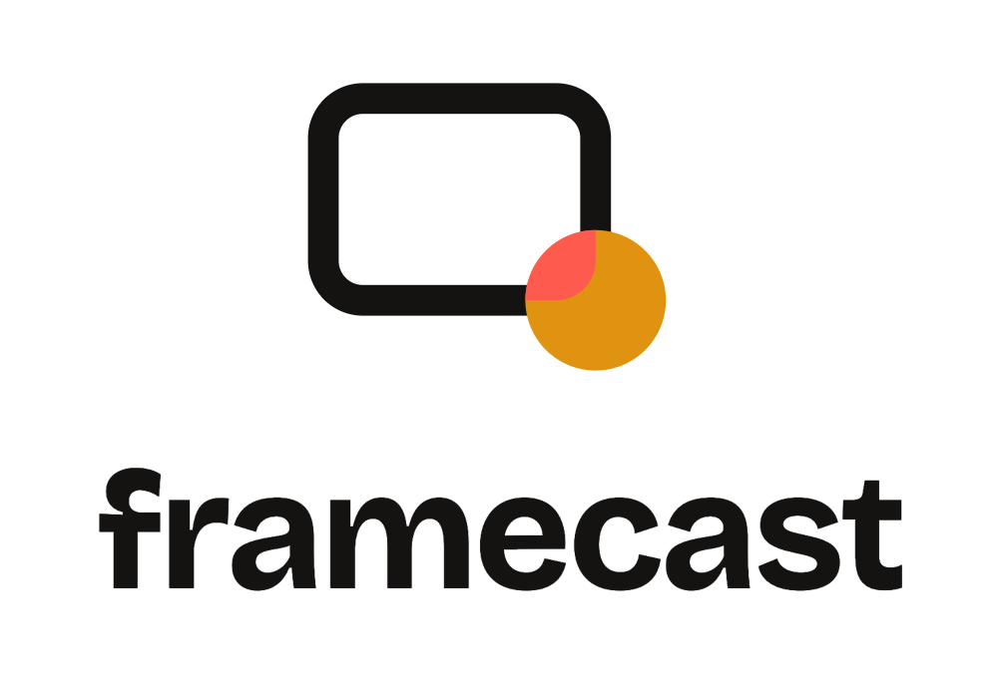

<div align="center">

<picture>
  <source media="(prefers-color-scheme: dark)" srcset="brand/framecast-lockup-dark.png">
  
</picture>

### A recording studio in a browser tab. 100% local.

Record your screen with a draggable, zoomable camera bubble, baked into the video as you move it.
Crash-safe MP4 straight to disk. Trim, convert and clean up audio without uploading a single byte.

[**Try it live**](https://framecast.amitrawat.dev) · [Quick start](#quick-start) · [Features](#features) · [How it stays local](#how-it-stays-local) · [Roadmap](#roadmap-phase-2)

[](https://github.com/sahajamit/framecast/actions/workflows/ci.yml)
[](https://framecast.amitrawat.dev)


</div>

---

Built for the daily-video workflow: open a tab, hit record, talk, stop, upload to YouTube. No accounts, no cloud, no telemetry. Your takes never leave your machine.

## Features

- **Three layouts**: screen + camera bubble, screen only, camera only
- **The camera bubble**: circle or rounded, draggable in the preview *and live during the take* (position is baked into the video), snap-to-corner, size slider, and a **zoom slider** so you can frame just your head, not your shoulders
- **Scene framing, baked in live (no editor step)**: wrap the capture in a styled backdrop with padding, rounded corners and a soft shadow, with the camera bubble free to overlap the frame edge for the "breaking the border" look. A curated set of code-drawn backdrops (studio gradients, warm textures, solids, plus a content-aware **blur** of your own screen that auto color-matches every take). Paid tools (Loom, Screen Studio, Cap) only do this in a post editor. framecast bakes it into the recording as you preview it, so the preview *is* the output. On by default, one click back to raw
- **Tab-viewport capture**: sharing a Chrome tab records exactly the page, no omnibox, no browser chrome
- **Floating control deck**: an always-on-top mini window (Document Picture-in-Picture) with live preview, drag-to-move bubble, mic mute + level meter, pause/resume, timer and stop
- **Crash-safe direct-to-disk recording**: WebCodecs hardware H.264 muxed into a fragmented MP4, flushed to disk every 2 seconds. A crashed tab leaves a recoverable take, not a lost one
- **Pause / resume** with a gapless timeline, plus a 3-2-1 countdown
- **Quality presets**: 1080p / 1440p / 4K at 30 or 60 fps (default 1440p30, crisp text on YouTube)
- **Microphone done right**: device picker, live LED meter, noise suppression / echo cancellation / auto-gain toggles, tab and system audio mixing where Chrome supports it
- **Review screen**: player, **trim** with filmstrip handles (tail cuts are instant packet copies), export to **MP4 / WebM / MOV**, and one-click **audio enhance** (RNNoise neural denoise + loudness normalization to YouTube's -14 LUFS), all processed locally
- **Recordings library**: your save folder, scanned with thumbnails, durations and quick actions
- **Light and dark themes** (the stage and players stay dark in both, the way a studio should)
- **Installable PWA**, works fully offline
- **Keyboard shortcuts**: `Space` pause · `S` stop · `M` mic · `C` bubble · `1`–`4` snap corners

## Quick start

```bash
git clone https://github.com/sahajamit/framecast.git
cd framecast
npm install
npm run dev
```

Open http://localhost:5173 in **Chrome or Edge 122+** (framecast uses Chrome-only capture APIs: Document Picture-in-Picture, WebCodecs, MediaStreamTrackProcessor, File System Access).

Or skip the clone entirely and use the hosted build: **[framecast.amitrawat.dev](https://framecast.amitrawat.dev)**. It is the same fully-local app; the server only ships static files.

> **macOS note:** the first screen capture asks for the *Screen Recording* permission
> (System Settings → Privacy & Security → Screen Recording → enable your browser, then restart it).
> Tab and window audio capture works; full-screen *system* audio is not reliably available on
> macOS. That is a Chrome/macOS limitation, not a framecast one.

## How it stays local

| Stage | What happens | Where |
|-------|--------------|-------|
| Capture | `getDisplayMedia` + `getUserMedia` | Chrome |
| Compositing | a Web Worker draws screen + camera bubble on an `OffscreenCanvas`, frame-driven so hidden tabs keep compositing | your CPU/GPU |
| Encoding | WebCodecs hardware H.264, AAC when the browser can encode it (Opus otherwise) | your GPU |
| Muxing | [mediabunny](https://mediabunny.dev) writes a fragmented MP4 incrementally | your RAM (seconds of it) |
| Disk | OPFS sync-access writes, flushed every 2 s, promoted to your chosen folder on stop | your SSD |
| Post (trim / convert / enhance) | mediabunny + RNNoise WASM + a BS.1770 loudness pass | your CPU |

No servers, no uploads. `npm run build` produces a static `dist/` you can serve from anywhere, or install it as a PWA and go fully offline.

## Development

```bash
npm test        # unit tests: bubble geometry, BS.1770 loudness, encoder presets
npm run e2e     # Playwright against real Chrome with fake capture devices
npm run lint
npm run build
```

The e2e suite records real files (Chrome fake camera/mic, auto-selected tab capture), then re-opens them with mediabunny to assert duration, codecs and A/V sync. That includes a renderer-crash recovery test. Agent-friendly repo notes live in [CLAUDE.md](CLAUDE.md).

## Roadmap (phase 2)

Teleprompter in the floating deck · dual-mic mixing / separate tracks · background blur · live zoom (punch into a region mid-take, [issue #6](https://github.com/sahajamit/framecast/issues/6)) · custom backdrop images · GIF export · 9:16 vertical mode · keyframe-snapped instant head-trim · optional Electron wrapper (global hotkeys, full system audio).

## License

MIT © [Amit Rawat](https://amitrawat.dev). Bundles [mediabunny](https://github.com/Vanilagy/mediabunny) (MPL-2.0) as a dependency.
